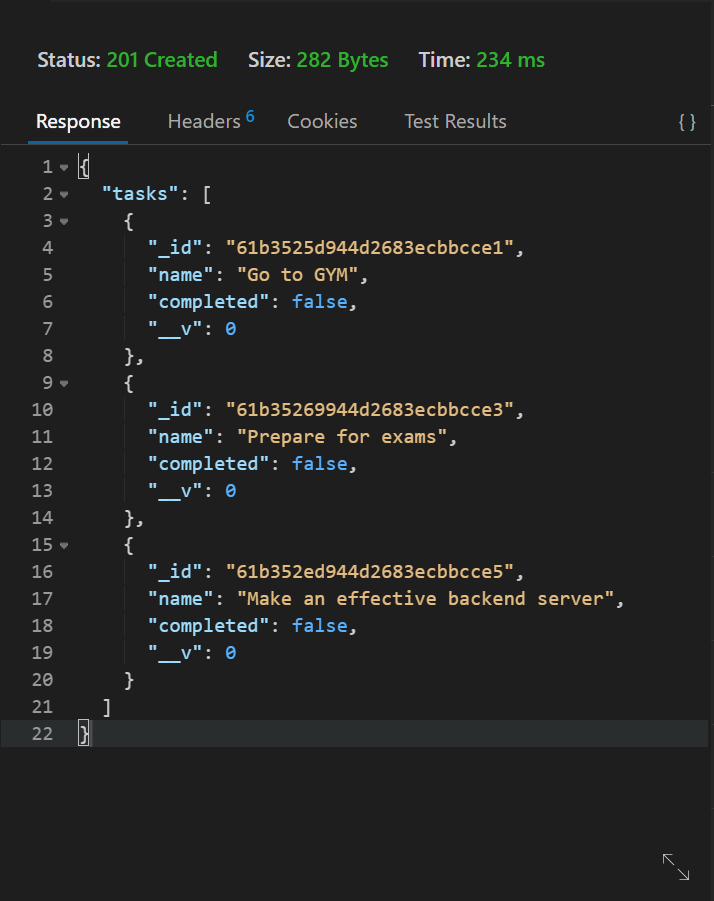
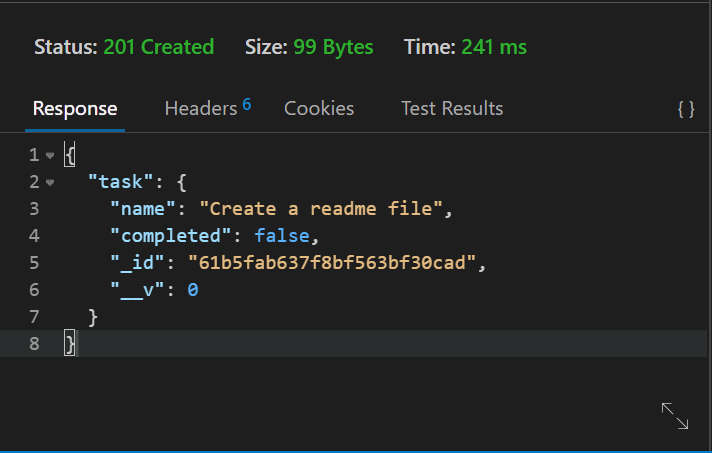
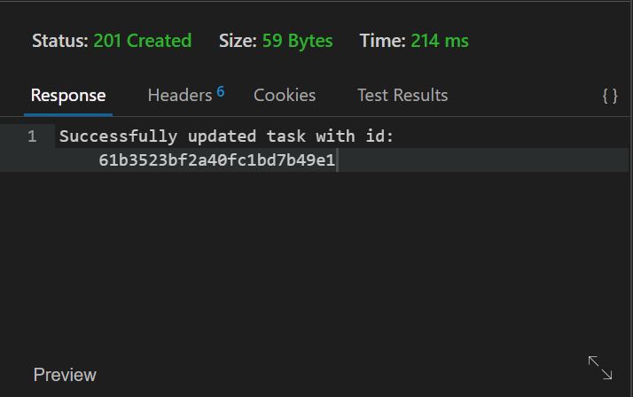
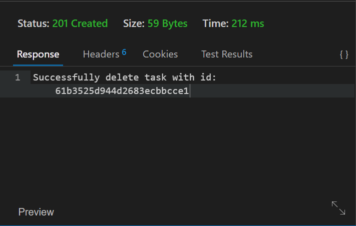

# Task Manager API
This API helps in adding and retriving your personal task data.

## Setup
1. Pull the repo into your local system.
2. Open your terminal and run 
   1. ```sh
        npm  init
        ```
3. After successful initialization run  
   1. ```sh
        npm  install
        ```
4. Now run the API server 
   1. ```sh
        nodemon app.js
        ```
5. Your server has started now you can use the API.
   
## Using the API
1.  ### Fetch all your task
    1. You need to hit the endpoint using GET method
       1.  ```localhost:3000/api/v1/tasks```
       2.  
2.  ### Fetch specific task
    1.  You need to hit the endpoint using GET method
        1.  ```localhost:3000/api/v1/tasks/"id```
        2.  You'll need to specify the id of the task
        3.  
3.  ### Add task
    1.  You need to hit the endpoint using the POST method with the task details in the body of the request
        1.  ```localhost/api/v1/tasks```
        2.  
4.  ### Update task
    1.  You need to hit the endpoint using PATCH method
        1.  ```localhost:3000/api/v1/tasks/"id```
        2.  You'll need to specify the id of the task
        3.  
5.  ### Delete task
    1. You need to hit the endpoint using DELETE method
        1.  ```localhost:3000/api/v1/tasks/"id```
        2.  You'll need to specify the id of the task
        3.  


### Configuring the API
You'll need to change the code while using the API.

You'll need to specify the MongoDB URI in place of ```process.env.MONGOURI```:
```js
await connectDB(process.env.MONGO_URI);
```
in app.js for connecting the server to your database.